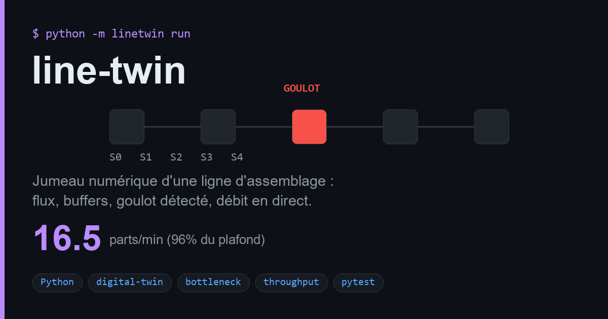

# line-twin

**Jumeau numérique d'une ligne de production série.**
Flux de pièces, buffers à capacité finie, **détection du goulot d'étranglement**, débit & WIP en temps réel.



Sur une ligne de N postes en série, un seul poste — le plus lent — impose le rythme de
toute la ligne. En amont les stocks saturent, en aval les postes tournent à vide. Ce jumeau
reproduit cette dynamique et **mesure** où est la contrainte, pour la chiffrer et l'optimiser.

```
  source ──▶ [buf] ──▶ S0 ──▶ [buf] ──▶ S1 ──▶ [buf] ──▶ S2 ──▶ ... ──▶ sortie
                                                          ▲
                                          goulot : sature l'amont, affame l'aval
```

## Ce que ça fait

- **Simulation à temps discret** d'une ligne série : chaque poste tire une pièce de son
  buffer, la traite pendant un temps de cycle bruité, puis la pousse en aval. Buffer plein →
  poste **bloqué** ; buffer vide → poste **à vide**.
- **Détection du goulot** à partir des dynamiques mesurées (charge effective =
  temps de cycle × utilisation) — robuste, pas juste « le plus gros chiffre ».
- **KPI ligne** : débit (pièces/min), plafond théorique, efficacité, WIP, utilisation /
  blocage / famine par poste — le tout sérialisable en JSON.
- **Pur stdlib**, zéro dépendance.

## Démarrage rapide

```bash
pip install -e .
python -m linetwin run --cycles 2,2,3.5,2,2 --buffer 5 --duration 600
```

```
station   cycle    util  blocked  starved   made
S0         2.0s     61%      39%       0%    179
S1         2.0s     59%      41%       0%    173
S2         3.5s     99%       0%       1%    167  <-- BOTTLENECK
S3         2.0s     58%       0%      42%    166
S4         2.0s     56%       0%      44%    165

throughput   16.5 parts/min   (ceiling 17.1)
efficiency   96.2%   WIP 15   produced 165
```

En Python :

```python
from linetwin import ProductionLine, snapshot

line = ProductionLine(cycle_times=[2, 2, 3.5, 2, 2], buffer_capacity=5, seed=1)
line.run(duration_s=600)
s = snapshot(line)
print(s.bottleneck, s.throughput_per_min, s.efficiency)   # S2 16.5 0.96
```

### Optimiser : et si on dédouble le goulot ?

```python
# S2 à 3.5s est la contrainte. En le ramenant à 1.75s (2 machines en parallèle),
# le plafond passe de 17 à ~30 pièces/min — chiffré avant d'investir.
fast = ProductionLine(cycle_times=[2, 2, 1.75, 2, 2], buffer_capacity=5, seed=1)
fast.run(600)
print(snapshot(fast).throughput_per_min)
```

## Architecture

| Module | Rôle |
|--------|------|
| `line.py` | `Station` (machine à états) + `ProductionLine` (moteur de simulation) |
| `metrics.py` | détection de goulot, débit, efficacité, WIP, snapshot JSON |
| `cli.py` | `python -m linetwin run` |

## Tests

```bash
pytest -q          # 5 passed
```

Les invariants testés : **conservation des pièces** (rien créé/perdu), le poste le plus lent
est bien le goulot, le débit est plafonné par le goulot, l'amont sature et l'aval s'affame.

## Stack

Python 3.9+ · zéro dépendance · `pytest` · assets via Pillow/numpy/imageio.

---
MIT · un jumeau simple, honnête et testable pour raisonner sur une ligne réelle.
